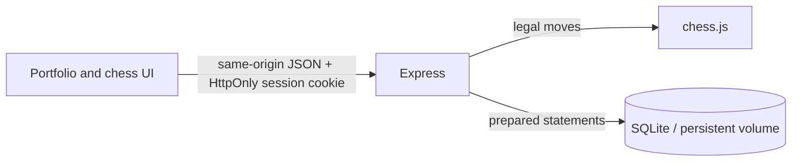

# Architecture

The original project used a browser → Node.js → PHP → MySQL request chain, with Pusher distributing events. The September 2026 maintenance pass consolidates this into a single Node.js service and a SQLite database. This reduces configuration and third-party credentials for a small self-hosted demonstration. The original implementation remains in Git history.

## Boundaries

- `server/app.js`: HTTP routes, input checks, authorization and gameplay transitions.
- `server/security.js`: asynchronous scrypt hashing and opaque session tokens. Only SHA-256 session digests are stored; passwords are never returned to the browser.
- `server/store.js`: prepared SQLite statements and persistent state.
- `blog/chess/app.js`: board rendering and requests. The client suggests a move; the server decides whether it is valid.
- `blog/`: portfolio and preserved early projects. Backend code and database files are outside the static root.

Every game read and mutation requires membership. Games have two seats; the second player is assigned by the server. Move history is replayed with chess.js so castling, en passant, promotion, turn order, checkmate and repetition can be evaluated from the actual game history. The UI rebuilds the board from the persisted FEN rather than moving a single DOM piece, so captures and castling stay consistent.

Sessions expire after ten hours and are revoked on logout. Same-origin JSON mutation requests, strict same-site cookies, request-size limits and rate limits reduce common web risks. Chat is rendered using `textContent`, never HTML. Game chat retains the latest 100 messages; each is limited to 500 characters.

## Deliberate limits

- Run one application process. Room reads, validation and writes are synchronous with no intervening `await`; they cannot interleave inside that process. Multiple processes sharing a database are not supported by this design.
- SQLite and two-second polling suit a small demo, not a large competitive chess service.
- There are no clocks, ratings, password reset, email verification, spectators or private/password-protected lobbies. Any signed-in player can take an open seat. The previous password-room feature is intentionally not carried forward.
- Finished games are retained. There is no automatic retention policy or account deletion UI yet; a public service needs these and operational monitoring.
- Rate limiting is in memory and resets on restart. Behind the supplied host proxy all requests share the proxy IP, so limits apply collectively. Configure a verified proxy topology before changing Express `trust proxy`; never blindly trust arbitrary forwarded headers.
- Early experiments are not represented as production applications. The fractal demos now reject non-integer/excessive input and clear the previous drawing.
